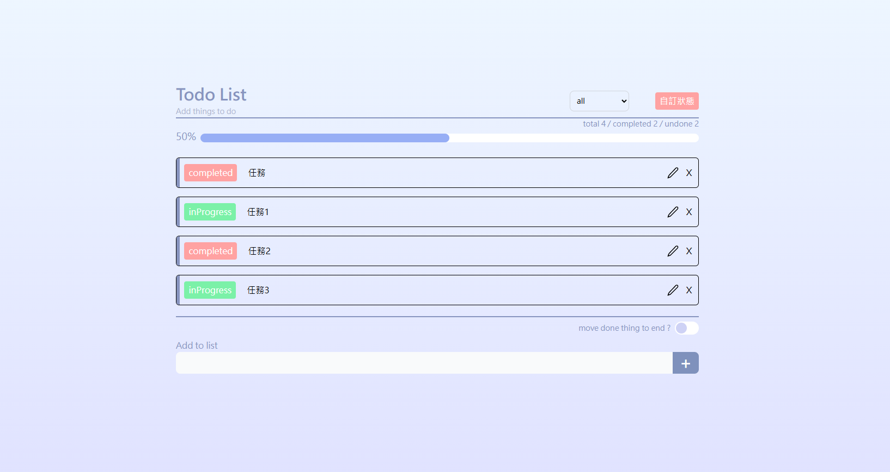

# 📌 功能

- 建立任務
- 刪除任務
- 修改任務
- 任務依照時間排序
- 任務依照是否完成排序
- 自由新增任務狀態
- 篩選任務狀態
- 任務時間顯示
- 任務進度顯示（每個任務完成度百分比）

---

# 🖼 畫面展示

---

# ⚙️ 安裝與執行方式

### ✅ 建議 Node.js 版本：

> Node.js **版本需為 14.0.0 或以上**，建議使用 LTS 版本（例如 18.x 或 20.x）

📥 安裝步驟：

# 切換到你想放置的資料夾

cd D:/Github

# 使用 git clone 指令

git clone https://github.com/S-herry/React_TodoList.git

# 進入後端專案資料夾

cd React_TodoList/Backend

# 安裝依賴

npm install

# 啟動後端伺服器

node index.js

# 後端 port

http://localhost:5001/

# 進入前端專案資料夾

cd React_TodoList/frontend

# 安裝依賴

npm install

# 啟動開發伺服器

npm run dev

# 開啟專案

http://localhost:8080/

# 📁 資料夾說明

- frontend/src/components React 元件
- frontend/src/hooks 自訂 hooks
- frontend/src/pages 頁面
- frontend/src/data 靜態資源

- Backend/api 路由設定
- Backend/data json 資料庫
- Backend/index 設定 port 和主要後端內容

# 🛠️ 使用技術

- Node.js：v20.16.0
- React：v19.0.0
- TypeScript：v5.7.2
- Tailwind CSS：v4.1.3
- React Router：v7.5.0
- sweetalert2:v11.19.1

# 📬 聯絡方式

如需聯絡，請透過：
📧 Email：hight7501@example.com
